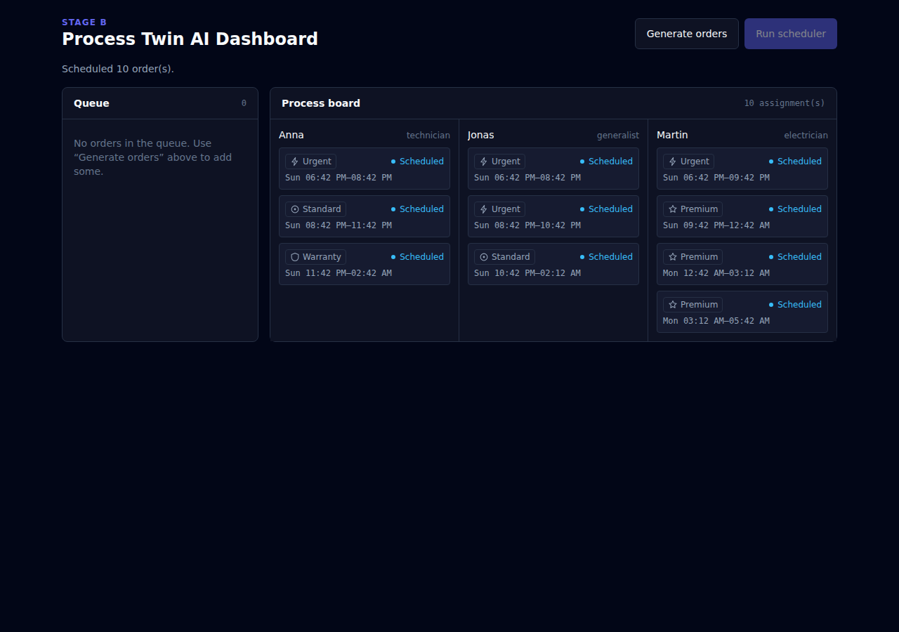
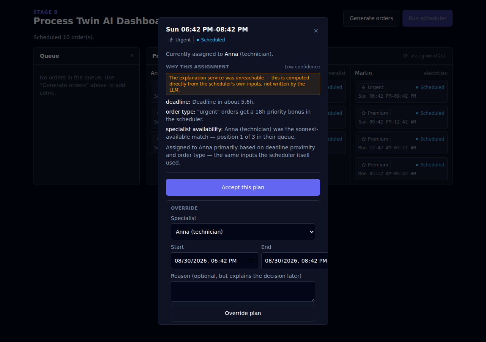
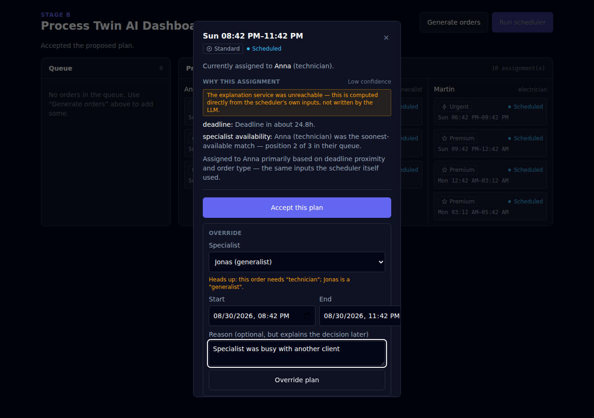

# Process Twin AI Dashboard

Research prototype: a simulated operational process (order intake → scheduling → explanation → human override) for a small service company, built to explore how AI can support — not replace — operational decisions.

**Status:** Stage A complete (synthetic orders, heuristic scheduler, live dashboard board). Stage B complete: AI explanations and human accept/override, end to end from the API through the UI. Metrics/history view is Stage C, not built yet.

See [`CLAUDE.md`](./CLAUDE.md) for the full project context, constraints, research questions, and development plan (Stage A–D).

## Screenshots

Board after generating and scheduling 10 synthetic orders — three specialist columns, empty queue:



Clicking an assignment opens its explanation — grounded in the scheduler's real inputs, not invented ones. No `ANTHROPIC_API_KEY` is configured in this particular run, so it's the deterministic fallback (`confidence: "low"`), which is exactly the degraded-but-honest path described below rather than a crash:



Overriding to a specialist whose type doesn't match the order's requirement — allowed, but flagged so the operator can judge it themselves:



## Structure

```
server/   Express + SQLite backend (routes/controllers/services/repositories, once added)
web/      React + Vite + Tailwind dashboard
```

## Quickstart

### Backend

```bash
cd server
npm install
cp .env.example .env
npm start
```

Runs on `http://localhost:3001`. `GET /health` → `{"status":"ok"}`.

### Frontend

```bash
cd web
npm install
npm run dev
```

Runs on `http://localhost:5173`.

## Testing

```bash
cd server
npm test
```

## Research questions

See [`CLAUDE.md`](./CLAUDE.md#2-исследовательские-вопросы). A dedicated README section with results is planned for Stage C, once there is decision history to report on.

## AI explanations

`GET /api/orders/:id/explanation` calls Claude (`claude-opus-5` — the skill-mandated default; override in `server/services/explanationService.js` if you want a cheaper model for this route) to explain a scheduled order's assignment in plain language, grounded only in the same inputs the scheduler itself used (deadline, order type's priority bonus, specialist availability/queue position) — no invented "priority" or "VIP" fields. Structured output is enforced via `client.messages.parse()` + a Zod schema, not manual `JSON.parse()`.

Requires `ANTHROPIC_API_KEY` in `server/.env`. Without it (or if the call fails for any reason), the endpoint degrades to a deterministic template built from the same raw factors — `confidence: "low"`, `source: "fallback"` — instead of a 500. Fallback responses aren't cached, so the next call retries the LLM; real explanations are cached in the `explanations` table (see `server/db/migrations/004_explanations.sql`).

## Human override

`POST /api/assignments/:id/accept` logs the operator's acceptance without changing anything. `POST /api/assignments/:id/override` (`{specialistId, plannedStart, plannedEnd, reason?}`) supersedes the current assignment, creates a new `created_by: "human"` one, and logs the reason — all in one transaction. `GET /api/decisions?orderId=` returns the full `ai_proposed` → `human_accepted`/`human_overridden` history for an order. Override does **not** block assigning a specialist whose type doesn't match the order's `required_specialist_type` — that's deliberate (see `docs/spec.md`), not an oversight.

## Known limitations (Stage A/B)

- No authentication — single-tenant, permissive CORS, not a production posture.
- Scheduler is a deterministic heuristic (earliest-deadline-first + type priority), not a learned model — see `server/services/schedulingService.js`.
- Scheduler ignores specialists' `hours_per_day` and day/working-hours boundaries; treats them as available back-to-back from the reference time.
- No metrics or decision-history view yet (% on-time, override rate, etc.) — that's Stage C.
