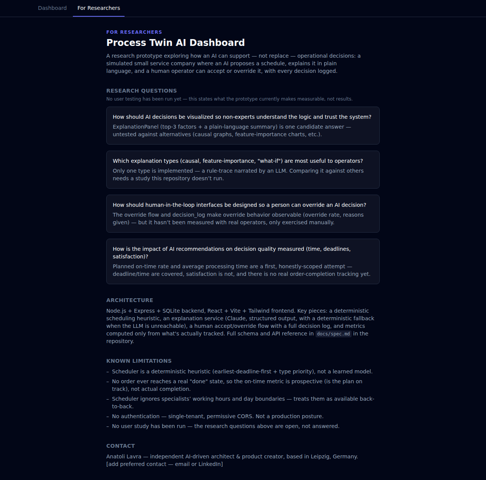
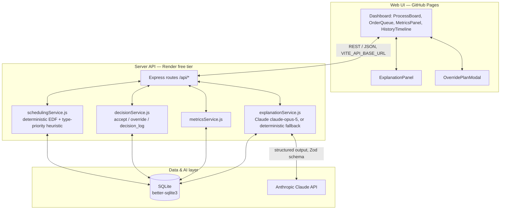

# Process Twin AI Dashboard

Research prototype: a simulated operational process (order intake → scheduling → explanation → human override) for a small service company, built to explore how AI can support — not replace — operational decisions.

**Status:** Stages A–D complete. Synthetic orders, heuristic scheduler, AI explanations, human accept/override, metrics/decision-history, a demo script, and a "For Researchers" page — all live, end to end from the API through the UI. See [`docs/demo-script.md`](docs/demo-script.md) for a guided 3–5 minute walkthrough.

See [`CLAUDE.md`](./CLAUDE.md) for the full project context, constraints, research questions, and development plan (Stage A–D).

## 🔗 Live demo

**[anatolilavra-droid.github.io/process-twin-ai-dashboard](https://anatolilavra-droid.github.io/process-twin-ai-dashboard/)**

Frontend on GitHub Pages, backend on Render's free tier. Click **Generate orders** then **Run scheduler** to populate the board. First request after a period of inactivity can take ~30–50s (Render's free plan spins the backend down when idle) — that's expected, not a bug; see [`docs/deployment.md`](docs/deployment.md) for details.

## Screenshots

Board after generating and scheduling 10 synthetic orders — three specialist columns, empty queue:


Clicking an assignment opens its explanation — grounded in the scheduler's real inputs, not invented ones. No `ANTHROPIC_API_KEY` is configured in this particular run, so it's the deterministic fallback (`confidence: "low"`), which is exactly the degraded-but-honest path described below rather than a crash:


Overriding to a specialist whose type doesn't match the order's requirement — allowed, but flagged so the operator can judge it themselves:


Metrics and decision history after a schedule run plus one accept and one override — note the metrics move (100% planned on-time, 10% override rate) and the history reads bottom-up as `AI proposed → Accepted` / `AI proposed → Overridden` with the operator's reason:


The "For Researchers" tab — same research questions as below, framed for an outside reader, with an honest limitations list and contact:



## Structure

```
server/   Express + SQLite backend (routes/controllers/services/repositories, once added)
web/      React + Vite + Tailwind dashboard
```

### 🏗️ Architecture overview



Storage is SQLite, not a hosted database — Render's free plan has no persistent disk, so `migrate`/`seed` re-run on every boot (see [`docs/deployment.md`](docs/deployment.md)). The scheduler is a deterministic heuristic, not a learned model (see "Known limitations").

## Quickstart

### Backend

```bash
cd server
npm install
cp .env.example .env
npm start
```

Runs on `http://localhost:3001`. `GET /health` → `{"status":"ok"}`.

### Frontend

```bash
cd web
npm install
npm run dev
```

Runs on `http://localhost:5173`.

## Testing

```bash
cd server
npm test    # Jest — 47 tests: routes, scheduler, explanation service, metrics, repositories
```

```bash
cd web
npm test    # Vitest — 33 tests: lib/format.js, api/client.js, OrderTypeTag, StatusBadge, the high contrast toggle
```

## Deployment

`render.yaml` (backend) and `.github/workflows/deploy-pages.yml` (frontend) are ready to go — [`docs/deployment.md`](docs/deployment.md) has the exact remaining steps (all one-time account/settings clicks: make the repo public, deploy the Render blueprint, set one GitHub Actions variable, turn on Pages).

## Research questions

Four questions this prototype is built to let someone investigate (full text in [`CLAUDE.md`](./CLAUDE.md#2-исследовательские-вопросы)) — **no user testing has been run yet, so there are no findings below, only what the prototype currently makes measurable:**

1. **How should AI decisions be visualized so non-experts understand the logic and trust the system?** `ExplanationPanel.jsx` is one candidate answer (top-3 factors + plain-language summary) — untested against alternatives (causal graphs, feature-importance charts, etc.).
2. **Which explanation types (causal, feature-importance, "what-if") are most useful to operators?** Only one type is implemented (a rule-trace narrated by an LLM, see "AI explanations" below) — comparing it against others needs a study this repo doesn't run.
3. **How should human-in-the-loop interfaces be designed so a person can override an AI decision?** `OverridePlanModal.jsx` + `decision_log` make the override flow and its outcomes observable (`overrideRate` in `GET /api/metrics`) — but override behavior hasn't been measured with real operators, only exercised manually.
4. **How is the impact of AI recommendations on decision quality measured (time, deadlines, satisfaction)?** `plannedOnTimeRate` and `avgProcessingHours` are a first, honestly-scoped attempt (see "Known limitations" — no real completion tracking exists) — deadline/time are covered, satisfaction is not.

## AI explanations

`GET /api/orders/:id/explanation` calls Claude (`claude-opus-5` — the skill-mandated default; override in `server/services/explanationService.js` if you want a cheaper model for this route) to explain a scheduled order's assignment in plain language, grounded only in the same inputs the scheduler itself used (deadline, order type's priority bonus, specialist availability/queue position) — no invented "priority" or "VIP" fields. Structured output is enforced via `client.messages.parse()` + a Zod schema, not manual `JSON.parse()`.

Requires `ANTHROPIC_API_KEY` in `server/.env`. Without it (or if the call fails for any reason), the endpoint degrades to a deterministic template built from the same raw factors — `confidence: "low"`, `source: "fallback"` — instead of a 500. Fallback responses aren't cached, so the next call retries the LLM; real explanations are cached in the `explanations` table (see `server/db/migrations/004_explanations.sql`).

## Human override

`POST /api/assignments/:id/accept` logs the operator's acceptance without changing anything. `POST /api/assignments/:id/override` (`{specialistId, plannedStart, plannedEnd, reason?}`) supersedes the current assignment, creates a new `created_by: "human"` one, and logs the reason — all in one transaction. `GET /api/decisions?orderId=` returns the full `ai_proposed` → `human_accepted`/`human_overridden` history for an order. Override does **not** block assigning a specialist whose type doesn't match the order's `required_specialist_type` — that's deliberate (see `docs/spec.md`), not an oversight.

## Metrics and decision history

`GET /api/metrics` returns three numbers, rendered as `MetricsPanel.jsx`: `plannedOnTimeRate`, `avgProcessingHours`, `overrideRate`. All three are `null` (never `0`) when there's no data yet, so an empty dashboard reads as "no data" rather than a misleading 0%. `plannedOnTimeRate` is named deliberately — it's whether the *current plan* meets each deadline, not whether work actually finished on time (see "Known limitations"). `HistoryTimeline.jsx` lists every `GET /api/decisions` entry, newest first, with the operator's reason where one was given.

## Accessibility

Every interactive element (buttons, the specialist `<select>`, date/time inputs, the modal's close button) has a visible `:focus-visible` outline, not just a browser default. Primary actions carry explicit `aria-label`s beyond their visible text — the assignment cards on the process board, for instance, expose their order type, status, specialist, and time window to assistive tech in one string, not just the visual layout. The override modal traps focus on open (focuses its close button) and closes on <kbd>Escape</kbd>.

A **High contrast** toggle sits in the dashboard header (`web/src/App.jsx` + `web/src/index.css`'s `:root.hc` block). It swaps the theme's CSS custom properties for a near-black/white palette and inverts the two solid accent buttons ("Run scheduler", "Accept this plan") to white-on-black — verified at a 21:1 contrast ratio, since the lighter accent color used for on-black text/borders would otherwise fail badly when paired with white button text (checked with the actual WCAG contrast formula, not eyeballed — see the commit that added this). The choice persists to `localStorage` so it survives a reload.

Not done: no automated accessibility audit (axe, Lighthouse) has been run against this app, and no screen reader walkthrough — the above was verified with real contrast-ratio math and Playwright interaction checks, not a full audit. A next pass would add one.

## For Researchers page and demo script

The `For Researchers` tab in the app (`web/src/pages/ForResearchers.jsx`) is a static, researcher-facing view of the same research questions, an architecture summary, the limitations list, and contact info — meant to be shown, not just read as markdown. [`docs/demo-script.md`](docs/demo-script.md) is a step-by-step ~3–5 minute live walkthrough of the whole app (generate → schedule → explain → override → metrics/history → this tab), written for presenting to an audience that hasn't seen the project before.

## Known limitations (Stage A–D)

- No authentication — single-tenant, permissive CORS, not a production posture.
- Scheduler is a deterministic heuristic (earliest-deadline-first + type priority), not a learned model — see `server/services/schedulingService.js`.
- Scheduler ignores specialists' `hours_per_day` and day/working-hours boundaries; treats them as available back-to-back from the reference time.
- No order ever reaches `status: "done"` — nothing in the app transitions it there — so `plannedOnTimeRate` is prospective (is the current plan on track), not a real on-time-completion rate. Don't read it as the latter.
- Accessibility (see "Accessibility" above) covers focus styles, `aria-label`s on primary actions, and a contrast-checked high contrast mode — but no automated audit (axe, Lighthouse) or screen reader walkthrough has been run.
